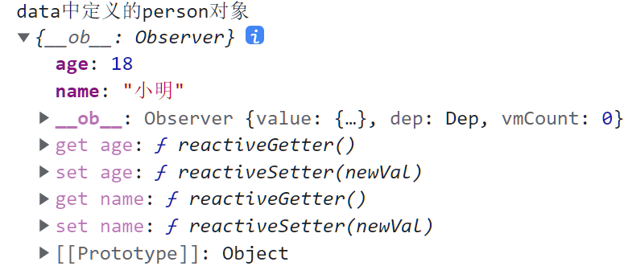
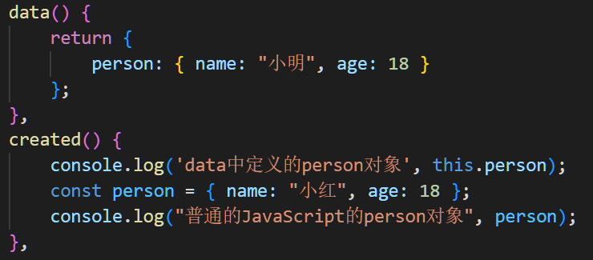
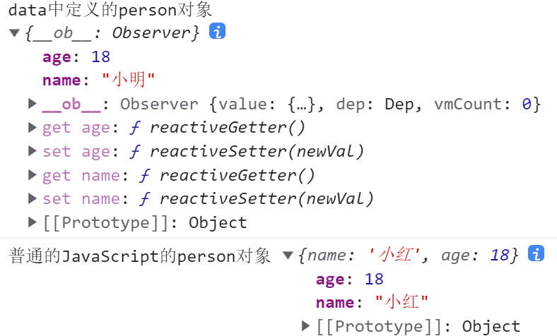
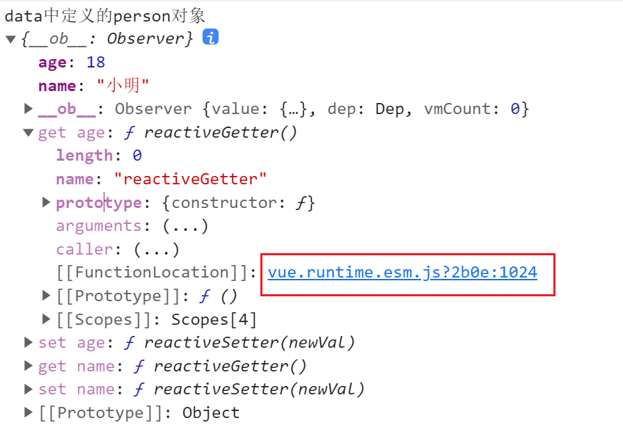
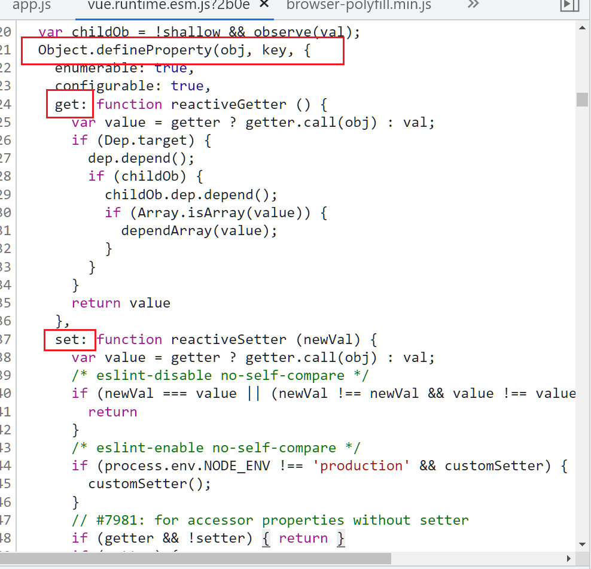
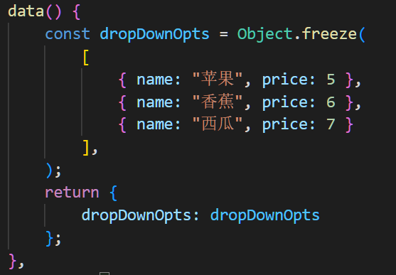

# vue2响应式原理 - 从实验结果看问题

## 初识getter和setter

不知道大家平常有注意到吗，当我们在打印vue data里的某一个对象时，在这个对象自身上会多一大堆乱七八糟的东西，比如：



为了对比更明显一点，我们可以再定义个普通的JavaScript对象对比一下，

代码如下：



打印结果如下：




现在是不是看的更明显了，data中定义的person对象有两个属性，分别是name和age，而打印出来在它自身上刚好就有与name对应的get name、set name以及与age对应的get age、set age，

这是什么神秘的东西呢？让我们在展开看看它的真面目，以age举例，点击图中红色圈出的地方，就会在控制台里跳到源码的位置，





到这，其实就已经在慢慢接近vue响应式原理的基本核心了，正如官网所说：

> 当你把一个普通的 JavaScript 对象传入 Vue 实例作为 `data` 选项，Vue 将遍历此对象所有的 property，并使用 [`Object.defineProperty`](https://developer.mozilla.org/zh-CN/docs/Web/JavaScript/Reference/Global_Objects/Object/defineProperty) 把这些 property 全部转为 [getter/setter](https://developer.mozilla.org/zh-CN/docs/Web/JavaScript/Guide/Working_with_Objects#定义_getters_与_setters)。
>
> 每个组件实例都对应一个 **watcher** 实例，它会在组件渲染的过程中把“接触”过的数据 property 记录为依赖。之后当依赖项的 setter 触发时，会通知 watcher，从而使它关联的组件重新渲染。

vue的响应式原理就是Object.defineProperty带给它的红利，所以与其理解响应式原理，不如我们先理解Object.defineProperty是什么？怎么使用？

根据mdn上对Object.defineProperty定义为：

> `Object.defineProperty()` 方法会直接在一个对象上定义一个新属性，或者修改一个对象的现有属性，并返回此对象。
>
> blabla...

好吧，看定义最烦了，先看下怎么使用吧，

Object.defineProperty(obj, prop, descriptor)接受3个参数，且3个都是必传参数，

- obj，要定义属性的对象
- prop，要定义或修改的属性的名称
- descriptor，要定义或修改的属性描述符

第3个参数descriptor里的可选参数有6个，configurable/enumerable/value/writable/get/set，其它的我们先不看，先看我们最眼熟的get和set，

试着将下面的代码复制到浏览器控制台后打印看看，

```js
let person = {
  name: "小明",
}
Object.defineProperty(person, 'age', {
      get() {
        console.log('getter函数触发');
      },
      set(value) {
        console.log('setter函数触发');
      }
})

console.log(person.name)
person.name = "小红"

console.log(person.age)
person.age = 20
```

为了对比，上例中person的两个属性name、age，name是用字面量的方式声明的，而age是通过Object.defineProperty声明的，

访问或修改person.name时和操作普通JavaScript对象无异，

但是访问或修改person.age时，get和set函数会被触发，里面的consolo.log语句随之打印，

vue正是利用Object.defineProperty里的get和set拦截器来控制对象的访问和修改，因为只要拦截得到，就可以在拦截时为所欲为了，官网对应的解释为：

> 这些 getter/setter 对用户来说是不可见的，但是在内部它们让 Vue 能够追踪依赖，在 property 被访问和修改时通知变更。
>
> 每个组件实例都对应一个 **watcher** 实例，它会在组件渲染的过程中把“接触”过的数据 property 记录为依赖。之后当依赖项的 setter 触发时，会通知 watcher，从而使它关联的组件重新渲染。

到这有没有发现，我所说的以及用来举证的例子都是针对对象而言，那如果是数组呢？

数组也是利用Object.defineProperty来实现其访问和修改的控制吗？

答案不是的，首先原生JavaScript Object.defineProperty这个api就不支持对数组的拦截操作。

那不对啊，既然不支持，在vue的data里我们声明一个数组，之后修改此数组是会触发其响应式更新的啊。

是的，这也是没错的，但是vue对数组的响应式更新并不是遍历数组的每一个元素然后为其绑定get set函数，而是vue拦截了数组常用的7种变更方法，

这7种变更方法是什么呢？官方文档在“列表渲染”一文中的“数组更新检测”一小节告诉了我们：

> Vue 将被侦听的数组的变更方法进行了包裹，所以它们也将会触发视图更新。这些被包裹过的方法包括：
>
> - `push()`
> - `pop()`
> - `shift()`
> - `unshift()`
> - `splice()`
> - `sort()`
> - `reverse()`

言外之意，在vue2里只有这7种方法才会触发data中数组的响应式更新，使用其它的数组变更方法改变数组或者直接通过索引修改数组元素都是不会触发响应式更新的。

## 响应式处理的时机

在项目上可能我们会碰到一种情况，那就是当我们为data中的某一个对象中的某一个属性赋予值时，发现并没有触发此对象的响应式更新，此时我们可能会想到直接使用this.$set()这个灵丹妙药。

这当然是没错的，但关键是，为什么不触发响应式更新呢？

解释这个之前，其实应该先明白，vue在哪个时刻进行了响应式处理？

官网在“深入响应式原理”一文中的“声明响应式property”说过：

> 由于 Vue 不允许动态添加根级响应式 property，所以你必须在初始化实例前声明所有根级响应式 property，哪怕只是一个空值

听起来有点晦涩，我们来扩展一下解释，

vue只有在初始化阶段才进行响应式处理，并且它只处理在data中声明的对象和其属性，

更啰嗦一点的解释，vue在响应式过后不会再进行响应式处理了(除非使用this.$set），以及未在data中声明的对象或其属性不会进行响应式处理

所以解释刚才上面的问题，原因可能就是，只在data中声明了对象，却未声明其属性，因为没有声明其属性，vue在初始化过程就不会对该属性进行getter和setter函数绑定，从而无法实现对其属性访问和修改的控制，也就无法响应式更新了。

## 灵丹妙药 - this.$set()

上节说到，在初始化过程还想触发data中的对象的某一个属性为响应式属性时，直接使用this.$set()这个灵丹妙药，这点在官网中也有提到：

> 向响应式对象中添加一个 property，并确保这个新 property 同样是响应式的，且触发视图更新。它必须用于向响应式对象上添加新 property

而this.$set干的事情，其实就跟初始化阶段干的事情一模一样，就是遍历该对象的所有属性，为其绑定getter和setter函数从而控制对象的访问和修改，来触发响应式更新，

而与之对应的另一个也会触发响应式更新的api就是this.$delete。

## Object.freeze()

vue会在初始化阶段为data中所有的对象进行响应式处理操作，这个操作肯定比单纯的创建普通js对象耗时。如果这个数据在使用过程会改变，那进行响应式处理来触发更新无可厚非。可是在一个页面中总有一些数据，比如下拉框的选项数组等，一旦初始化过后就不会再改变，那如果能略过对它的初始化操作，是不是能节省点初始化时间呢？

答案是肯定的，那就是使用Object.freeze()，在官网上，对其这么解释：

> 使用 `Object.freeze()`，这会阻止修改现有的 property，也意味着响应系统无法再*追踪*变化。

此时在打印这个data对象，在它自身上就不会有与属性对应的get set拦截器了，变成了一个普通的JavaScript对象，

代码如下：



打印结果如下：


## 总结

到这，对vue2响应式原理的理解就说完了。简单做个总结：

- vue2响应式原理：
  - 初始化阶段遍历data里的所有property，并使用Object.defineProperty把这些property全部绑定getter/setter函数，从而达到对对象的访问和修改的控制
  - 每个组件实例都对应一个watcher实例，它会在组件渲染的过程中把“接触”过的数据property记录为依赖。之后当依赖项的setter触发时，会通知 watcher，从而使它关联的组件重新渲染
  - vue2对对象的检测是，为对象的每一个属性绑定Object.defineProperty的get、set方法（包括嵌套属性，需要递归）从而实现响应式
  - vue2对数组的检测是，对数组7个变更方法进行重载（push()、pop()、shift()、unshift()、splice()、sort()、reverse()），其它变更方法或直接通过索引修改数组元素并不能触发响应式更新
  - Vue无法检测根级别property的动态添加或移除，因此初始化过后仍需添加响应式property应使用Vue.set()或Vue.delete()

- vue2响应式原理缺点：
  - 无法检测数组元素的新增或删除，需要对数组方法进行重写，无法检测数组长度修改
  - 无法检测到对象属性的添加或删除
  - 必须遍历对象的每个属性，为每个属性都进行get、set拦截
  - 必须遍历深层嵌套的对象属性

你看，Object.defineProperty的缺点还是不少的，随着es6 proxy的到来，在能力上已经秒杀了Object.defineProperty，vue3的响应式原理也已经完全抛弃Object.defineProperty转而使用es6。也因为使用了proxy，原本vue2响应式处理上的缺点也都一一得到了解决。

